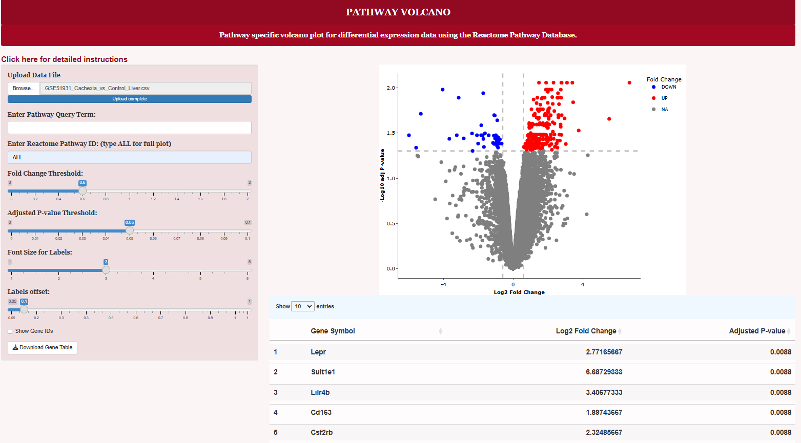
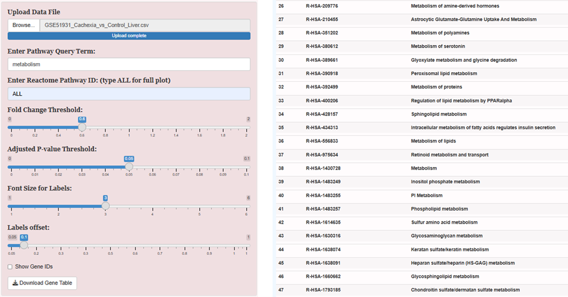
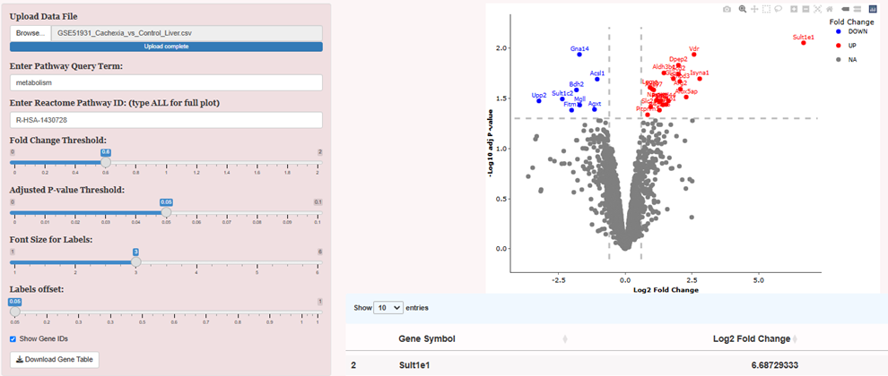
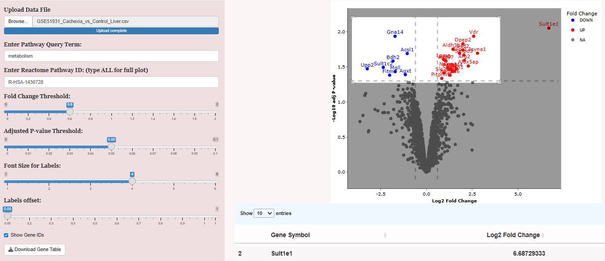
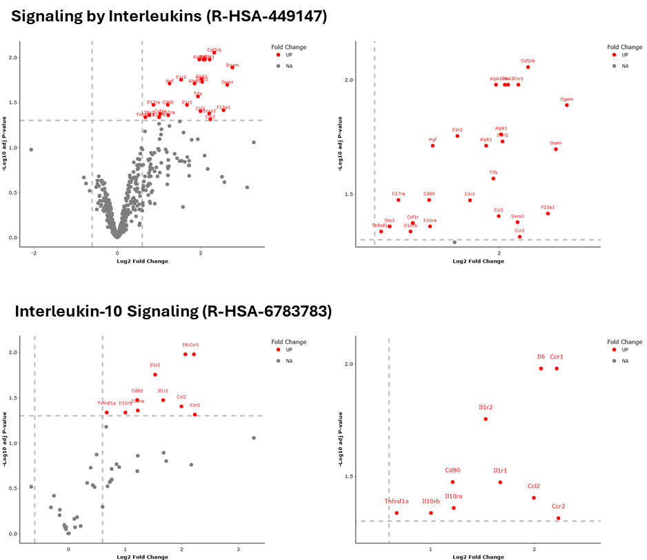

**Example Analysis**
When you select the **Use Example Dataset** option, the file GSE51931_Cachexia_vs_Control_Liver.csv will be loaded.  This file was extracted from the GEO database and will be used to show the workflow of a typical analysis (Gilabert et al., Pancreatic cancer-induced cachexia is Jak2-dependent in mice, J Cell Physiol, 10, 1437, 2014).  Below is the window showing the input of the dataset in the Upload Data File box.  To see the entire dataset, input the word ALL into the Enter Reactome Pathway ID.

After pressing Use Example Dataset, type *All** into the Enter Pathway ID box.  This will show the whole dataset.  The Enter Pathway Query Term box allows the user to enter a term which will then return a list of all of the Reactome Pathways with that term in the name.  

**Visualizing Data for Different Pathways**

The Reactome Database currently includes more than 2700 pathways.  These pathways range is specificity from broad to very specific.  An example of a broad pathway would be Metabolism.  As shown below, the term metabolism can be input into the Enter Pathway Query Term and at the bottom of the screen will be listed all of the pathways that contain the term metabolism.  

There were 90 pathways that contained this term and #38 is the general pathway R-HSA-1430728 Metabolism.  When that Pathway ID is put into the Enter Reactome Pathway ID box the following volcano plot is generated.

Left click and dragging the mouse on the volcano plot gives an expanded region of the plot.

At any point the sliders to adjust the thresholds for Fold Change, P-value, Font Size for Labels and Label Offset can be adjusted.  Not that although the fold change and adjusted p-values are log2 and -log10 transformed on the plot, the raw values are provided on the sliders for simplicity.  

**Integration with Over-Representation or Over-Enrichment Studies**

Selecting which pathways to examine using this tool can be influenced by many factors.  Additional experimental data or even biological intuition can guide the exploration.  An efficient way to select pathway is to input the significantly altered genes into an over-enrichment or over-representation analysis tool.  The 284 significantly altered genes from this dataset were uploaded to the Reactome Overrepresentation analysis and the top two pathways were Interleukin-10 Signaling (R-HSA-6783783) and the broader Signaling by Interleukins (R-HSA-449147).  Expansions of the volcano plots focusing on these two pathways are shown below.  

Note that the list of genes in your dataset that are part of the specified pathway can be downloaded by clicking on the Download Gene Table button at the bottom of the red panel on the left.  

